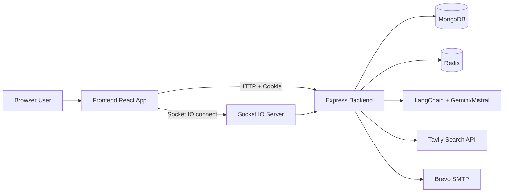
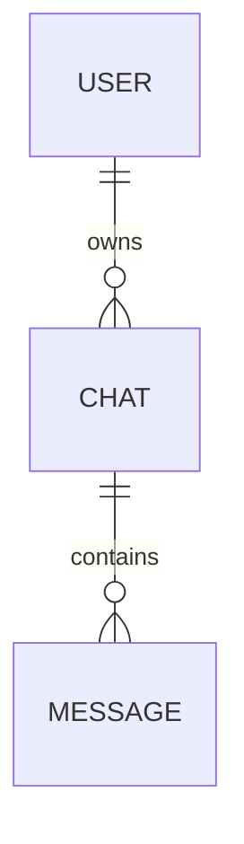
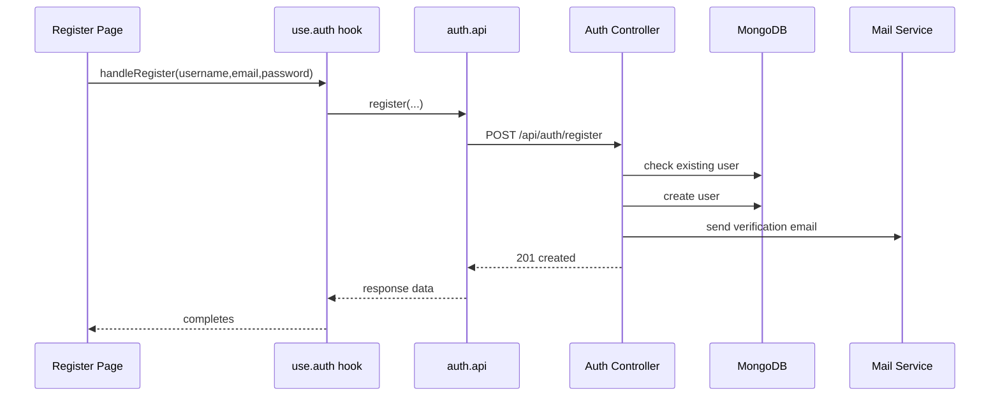
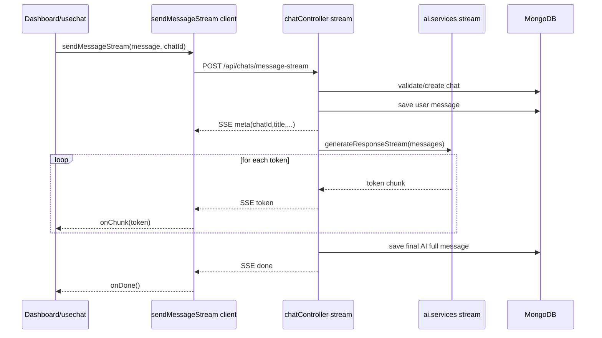

# PURA AI Project Architecture and Working

## 1. What this project is

PURA AI is a full-stack AI chat application with:

- User authentication (register, email verification, login, logout)
- Protected dashboard
- Multi-chat history per user
- AI response generation (regular and streaming)
- Optional web search augmentation for fresh information

The codebase is split into:

- Backend: Express API + MongoDB + Redis + Socket.IO + AI/Mail/Search services
- Frontend: React + Redux Toolkit + React Router + Axios/fetch

## 2. High-level architecture

## 3. Folder responsibilities

### 3.1 Backend

- Backend/server.js: process entry, env load, DB connect, HTTP server creation, socket init, listen
- Backend/src/app.js: express setup (json, cors, cookie parser, logging), route mounting, static frontend serving
- Backend/src/config: infrastructure adapters
  - database.js: Mongoose connection
  - cache/cache.js: Redis client
- Backend/src/routes: endpoint definitions
  - auth.routes.js: auth endpoints
  - chat.routes.js: chat endpoints
- Backend/src/controllers: request handlers and orchestration
  - authController.js
  - chatController.js
- Backend/src/middlewares: shared middleware
  - auth.middleware.js: cookie JWT verification + blacklist check
- Backend/src/models: Mongoose schemas
  - user.model.js
  - chat.model.js
  - message.mode.js
- Backend/src/services: external/business services
  - ai.services.js
  - mail.services.js
  - tavily.service.js
- Backend/src/sockets/server.socket.js: Socket.IO bootstrap singleton

### 3.2 Frontend

- Frontend/src/main.jsx: React app mount and Redux provider
- Frontend/src/app:
  - App.jsx: initial current-user fetch
  - app.routes.jsx: route graph
  - app.store.js: Redux store config
- Frontend/src/features/auth:
  - auth.slice.js: auth state reducers
  - hooks/use.auth.js: auth async flow wrappers
  - services/auth.api.js: auth HTTP client calls
  - components/Protected.jsx: private route gate
  - pages/Login.jsx, Register.jsx, EmailVerification.jsx: auth UI
- Frontend/src/features/chat:
  - chat.slice.js: chat state reducers
  - hooks/usechat.js: chat orchestration logic
  - pages/Dashboard.jsx: main chat UI and interactions
  - service/chatapi.js: chat HTTP + streaming API client
  - service/chat.socket.js: Socket.IO client bootstrap
- Frontend/src/validators/auth.validator.js: validator middleware file (currently backend import is commented)

## 4. Backend boot flow

1. Backend/server.js loads env.
2. connectToDb() from database.js is called.
3. Express app from app.js is wrapped by Node HTTP server.
4. initSocket(httpServer) starts Socket.IO on same server.
5. HTTP server listens on PORT.

### 4.1 Backend middleware stack and route mounting

In Backend/src/app.js:

1. express.json() for JSON bodies
2. cors(...) with credentials enabled and allowedOrigins
3. morgan("dev") request logs
4. cookieParser() for auth token cookie parsing
5. /api/auth -> auth routes
6. /api/chats -> chat routes
7. static file serving from Backend/dist
8. wildcard route returning dist/index.html

## 5. Frontend boot flow

1. Frontend/src/main.jsx renders App inside Redux Provider.
2. App.jsx runs fetchCurrentUser() on mount.
3. Router from app.routes.jsx decides which page to show.
4. Protected.jsx blocks dashboard when auth.user is missing.

## 6. Data model and relationships

### 6.1 User model (user.model.js)

Fields:

- username (required, unique)
- email (required, unique)
- password (required, select false)
- verified (default false)
- timestamps

Behavior:

- pre-save hook hashes password using bcryptjs
- comparePassword(candidate) compares plain password with hash

### 6.2 Chat model (chat.model.js)

Fields:

- user (ObjectId ref)
- title (required)
- timestamps

### 6.3 Message model (message.mode.js)

Fields:

- chat (ObjectId ref)
- content (string)
- role (enum: user, ai)
- timestamps

### 6.4 Relationship chain

Practical relationship:

- One user can own multiple chats
- One chat can have multiple messages
- Messages alternate between user and ai roles

## 7. Auth flow (clear step-by-step)

### 7.1 Register flow

Detailed behavior in authController registerController:

1. Reads username, email, password from body
2. Checks duplicate username/email
3. Creates user document (password hash runs in model hook)
4. Creates verification token with JWT_SECRET
5. Builds verification URL: BACKEND_URL/api/auth/verify-mail?token=...
6. Sends email via sendEmail()
7. Returns created user payload

### 7.2 Email verification flow

1. User clicks email link to backend endpoint /api/auth/verify-mail?token=...
2. verifyMailController validates token
3. Finds user by decoded email
4. Sets verified=true and saves user
5. Returns success HTML page

Note: frontend /verify-email page is informational only and does not consume token itself.

### 7.3 Login flow

1. Login page calls handleLogin(email,password)
2. auth.api sends POST /api/auth/login
3. loginController loads user with password field
4. Compares password via comparePassword
5. Checks verified status
6. Signs JWT (expires 1 day)
7. Sets httpOnly cookie token
8. Returns user data

### 7.4 Current user and protected route flow

1. App mount triggers fetchCurrentUser()
2. auth.api calls GET /api/auth/get-me
3. Backend route runs authMiddleware first
4. Middleware reads req.cookies.token
5. Checks redis blacklist
6. Verifies JWT and attaches decoded payload to req.user
7. getUserDetailsController loads user by req.user.id
8. Frontend auth slice stores user
9. Protected component allows dashboard when user exists

### 7.5 Logout flow

1. Dashboard sign-out triggers handleLogout()
2. auth.api sends POST /api/auth/logout
3. logoutController reads cookie token
4. Writes token to Redis blacklist with 1-hour TTL
5. Clears token cookie
6. Frontend clears auth and chat state, then navigates to /login

## 8. Chat flow (regular + streaming)

### 8.1 Regular non-stream message flow

Endpoint: POST /api/chats/message

1. Auth middleware verifies user
2. Controller validates chat ownership if chatId provided
3. For new chat, generateTitle(message) and create chat
4. Save user message in messages collection
5. Load chat history messages
6. generateResponse(messages) asks AI agent
7. Save AI message
8. Return userMessage + aiMessage (+chat if new)

### 8.2 Streaming message flow (current main path)

Endpoint: POST /api/chats/message-stream

Client behavior in usechat hook:

1. Optimistically appends temporary user message
2. Optimistically appends empty AI message
3. Calls chatapi sendMessageStream
4. On meta event, if no current chat, adds chat to sidebar and sets currentChatId
5. On token event, appends token to last AI message content
6. On done event, sets generating false

## 9. AI and external services working

### 9.1 AI service architecture

File: Backend/src/services/ai.services.js

Main parts:

- model: ChatGoogleGenerativeAI (Gemini flash lite)
- mistralModel: ChatMistralAI (mistral-medium-latest)
- shouldSearchInternet(question): asks Mistral to output YES or NO
- searchInternetTool: LangChain tool wrapping tavilySearch()
- agent: createAgent with mistralModel + search tool

Functions:

- generateResponse(messages): full-response path using tool-capable agent
- generateTitle(message): short chat title generation
- generateResponseStream(messages):
  - checks if internet search is needed
  - if needed, appends search result context to prompt
  - streams token chunks from Mistral model

### 9.2 Tavily service

File: Backend/src/services/tavily.service.js

- Initializes Tavily client with TAVILY_API_KEY
- tavilySearch({query}) returns JSON string of results
- On error, returns JSON string with error field

### 9.3 Mail service

File: Backend/src/services/mail.services.js

- Creates nodemailer transporter for Brevo SMTP relay
- Verifies SMTP connection at startup
- sendEmail({to, subject, html, text}) sends email and logs result

## 10. Socket layer working

### 10.1 Backend socket server

File: Backend/src/sockets/server.socket.js

- initSocket(httpServer) initializes socket server with CORS origin from FRONTEND_URL
- logs connected socket ids
- getIO() returns singleton io instance

### 10.2 Frontend socket client

File: Frontend/src/features/chat/service/chat.socket.js

- initializeSocketConnection() creates singleton client and logs on connect
- getSocket() returns instance

### 10.3 Current usage reality

- Socket connection is initialized, but no chat message emit/on events are implemented.
- Actual AI answer streaming currently happens via SSE over HTTP, not via Socket.IO events.

## 11. Frontend state management details

### 11.1 Auth slice

State:

- user
- loading
- error

Actions:

- setUser
- setLoading
- setError

### 11.2 Chat slice

State:

- chats
- currentChatId
- messages
- loading
- IsGenerating

Actions:

- setChats
- setCurrentChatId
- setLoading
- setMessages
- addChat
- addMessage
- setError
- setIsGenerating
- updateLastAIMessage

## 12. API map

### 12.1 Auth routes

- POST /api/auth/register
- GET /api/auth/verify-mail
- POST /api/auth/login
- GET /api/auth/get-me (protected)
- POST /api/auth/logout

### 12.2 Chat routes (all protected)

- POST /api/chats/message
- POST /api/chats/message-stream
- GET /api/chats/
- GET /api/chats/message/:chatId
- DELETE /api/chats/:chatId

## 13. End-to-end request life cycle (generic)

1. User action in React page
2. Hook function called
3. API service executes HTTP request with credentials
4. Express route receives request
5. Optional auth middleware validates cookie JWT
6. Controller applies business logic
7. Services are used for AI/search/mail as needed
8. Data saved/read in MongoDB
9. Response returned (JSON or SSE stream)
10. Redux state updated and UI rerendered

## 14. Important implementation notes and current gaps

These are observed from the current code and affect behavior:

1. Frontend register API function has variable/scope errors in auth.api.js (uses err/res/response inconsistently).
2. Streaming fetch uses relative path in chatapi.js, while other API calls use VITE_API_URL base URL.
3. Login/Register pages navigate regardless of auth success because hook errors are swallowed.
4. user model name is "user" while chat ref uses "User" (case mismatch risk for populate/reference consistency).
5. database.js connect logging uses then(console.log(...)) pattern incorrectly and lacks catch handling.
6. auth.middleware.js fetches user by id but does not enforce existence before next().
7. chat slice writes state.isLoading while initial state key is loading.
8. Logout route is not protected and returns 404 when token missing.
9. Socket.IO is connected but not used for message transport; streaming is SSE.
10. register validator exists but is not wired into auth routes.

## 15. Suggested architecture improvements

1. Standardize API base URL usage across Axios and fetch streaming.
2. Make auth hooks return success/failure and navigate conditionally.
3. Add unified error-handling middleware in backend.
4. Add schema-level and request-level validation on auth/chat payloads.
5. Normalize naming (message.model.js, ref strings, state keys).
6. Decide one real-time strategy: SSE-only or full Socket.IO events.
7. Add tests for auth flow, middleware behavior, and stream parsing.

## 16. Quick mental model

Think of this system as:

- Frontend hooks orchestrate user actions.
- Backend controllers orchestrate domain operations.
- Services provide integrations (AI, search, mail).
- Mongo stores chats/messages/users.
- Redis stores invalidated JWTs.
- SSE streams AI tokens to the UI in real time.

That is the complete working architecture of the current project state.
